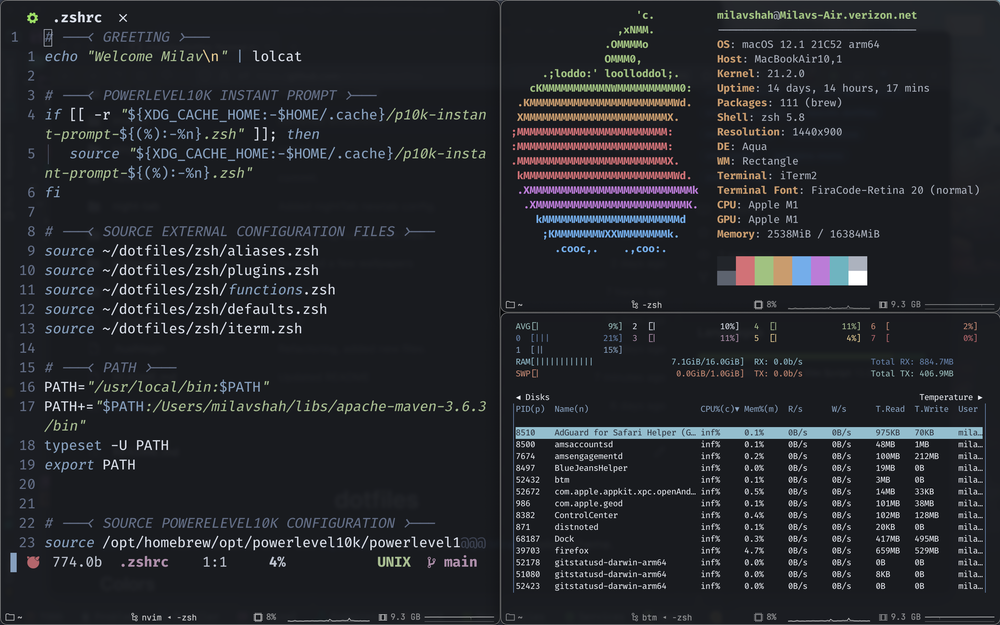

# milav's dotfiles

Want the same look as the screenshot? Use the [Fira Code](https://github.com/tonsky/FiraCode) font and the [darkside](https://github.com/shahmilav/darkside-iTerm2) color scheme.

* **Terminal:** iTerm2
* **OS:** macOS btw
* **Text Editor:** Neovim
* **IDE:** IntelliJ
* **System Monitor:** Bottom
* **Colorscheme:** Nord or [darkside](https://github.com/shahmilav/darkside-iTerm2)
* **Font:** SF Mono
* **Browser:** Firefox Nightly

## Current Setup
* Nord for IntelliJ, iTerm, and Neovim
* SF Mono Font
