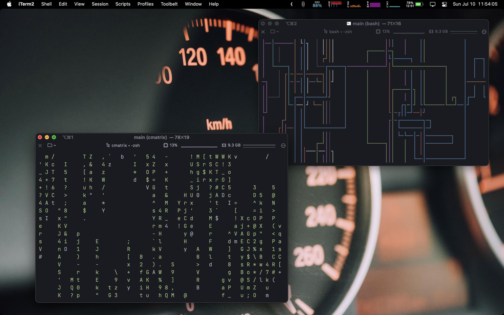
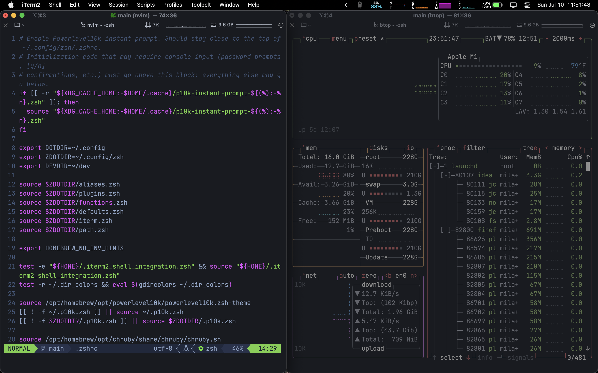

# milav's dotfiles

* **Terminal:** iTerm2
* **OS:** macOS btw
* **Text Editor:** Doom Emacs
* **IDE:** IntelliJ
* **System Monitor:** btop
* **Colorscheme:** Nord 
* **Font:** SF Mono
* **Browser:** Firefox Nightly

## Current Setup
* for IntelliJ, iTerm, and Neovim
* SF Mono Font
