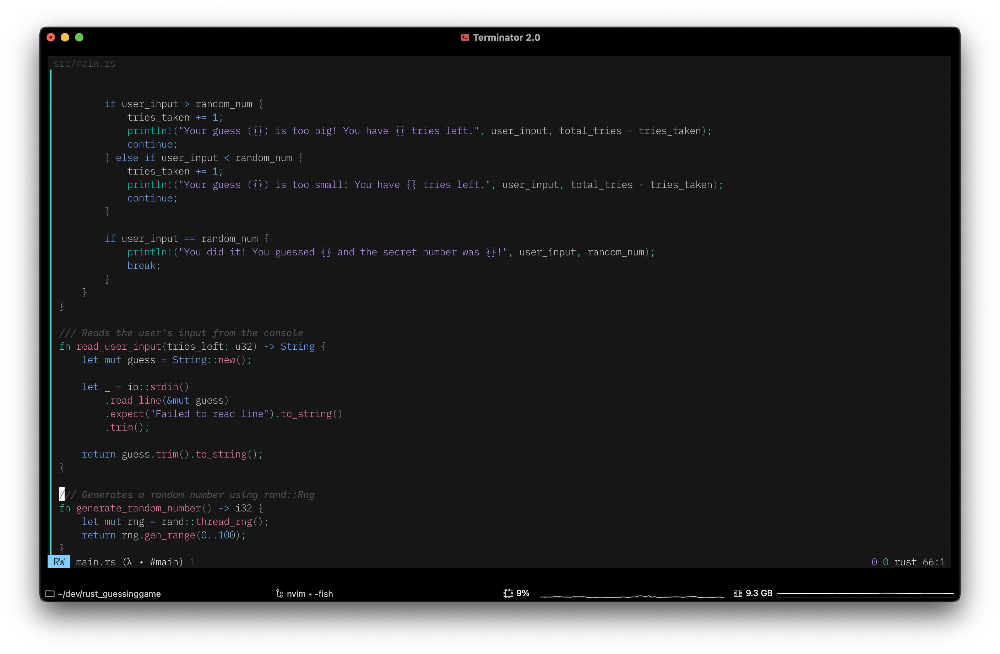
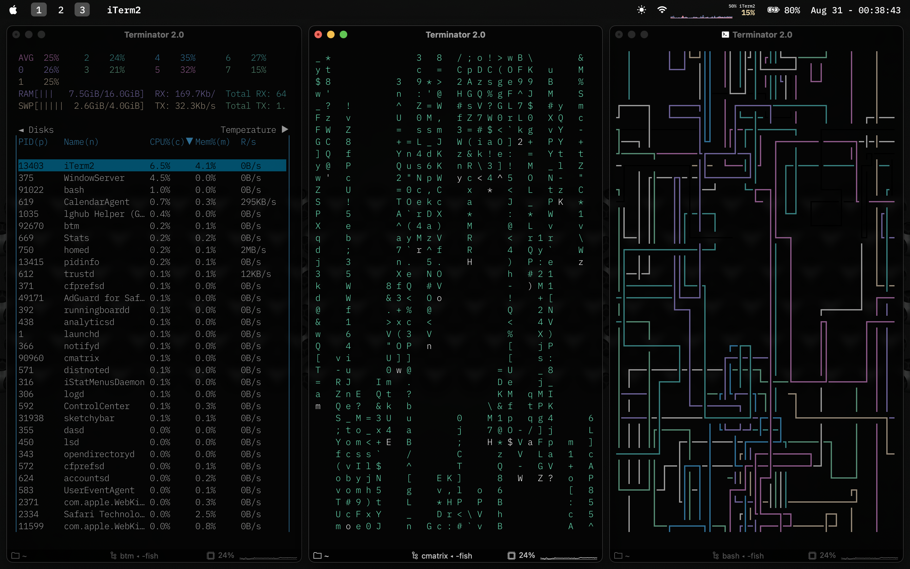
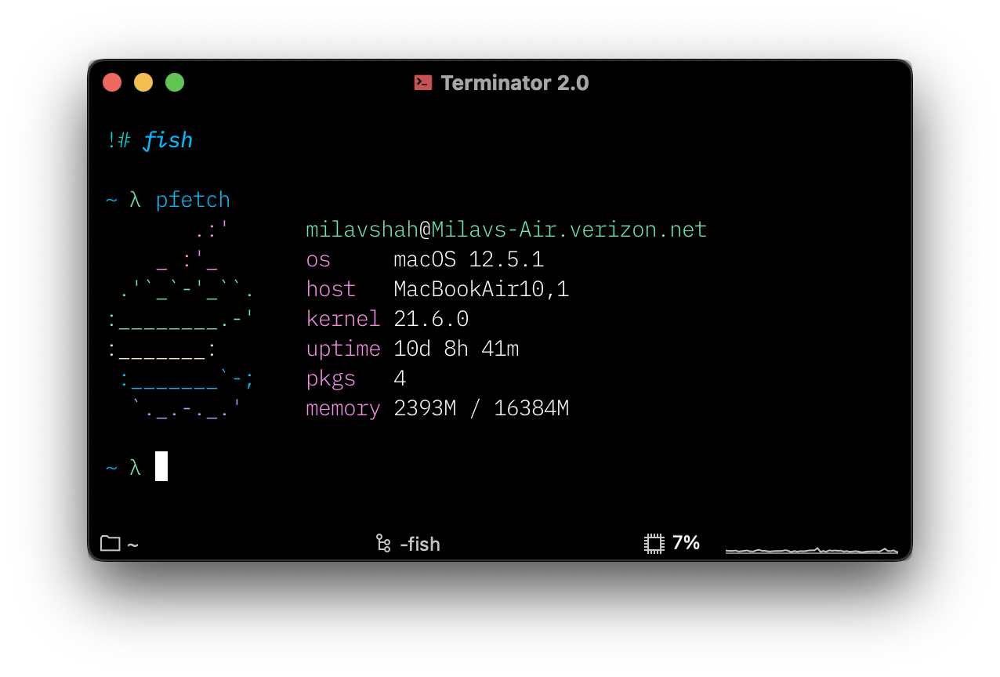

<div align="center">

```
________________ ________ ________ _______ _____   ____________________________ __________________ 
__  ____/___    |___  __ \___  __ )__  __ \___  | / /___  ____/____  _/___  __ )___  ____/___  __ \
_  /     __  /| |__  /_/ /__  __  |_  / / /__   |/ / __  /_     __  /  __  __  |__  __/   __  /_/ /
/ /___   _  ___ |_  _, _/ _  /_/ / / /_/ / _  /|  /  _  __/    __/ /   _  /_/ / _  /___   _  _, _/ 
\____/   /_/  |_|/_/ |_|  /_____/  \____/  /_/ |_/   /_/       /___/   /_____/  /_____/   /_/ |_|  

```
# Carbonfiber: fast and functional macOS config

[Docs](#Documentation) • [Screenshots](#Screenshots)
</div>

## Screenshots






## Documenation
While this config _should_ work on Linux, it was only tested on macOS.

### Wallpaper
The wallpaper is the [Pro Display XDR](https://basicappleguy.com/basicappleblog/xdr) wallpaper by BasicAppleGuy. 
More versions of the wallpaper are available [here](https://basicappleguy.com/basicappleblog/xdr), in HEIC and JPG formats. 

* wallpaper [here](./TitaniumDynamicXDR.heic)

### iTerm2
The iTerm2 config can be found [here](./iterm2/CarbonfiberProfile.json).
The font used in iTerm2 is **JetBrains Mono Extra Light**. Note that the screenshots still need to be updated regarding the font. 
The font in the screenshots is **IBM Plex Mono Light**.

The colorscheme used is a personal port of the [Modus Vivendi](https://protesilaos.com/emacs/modus-themes) theme from Emacs. It can be downloaded [here](https://raw.githubusercontent.com/shahmilav/carbonfiber-dots/main/iterm2/Modus%20Vivendi.itermcolors).

* config folder [here](./iterm2)

### Neovim
The neovim config is [Nyoom.nvim](https://github.com/shaunsingh/nyoom.nvim).
The colorscheme used is the Nyoom default, [oxocarbon.nvim](https://github.com/shaunsingh/oxocarbon.nvim). In my opinion, it looks _beautiful_.

* config folder [here](./nvim)

### Yabai & skhd
These two are grouped together since they work as one. SKHD is the hotkey daemon, yabai is the window manager.
The config(s) are very simplistic but it works well.

**Note that I have not disabled SIP for yabai.**

* yabai config folder [here](./yabai)
* skhd config folder [here](./skhd)

### Sketchybar
For my bar, I use [sketchybar](https://felixkratz.github.io/SketchyBar/). Super configurable, and fast.

* config folder [here](./sketchybar)

### fish shell
The fish shell config is very personal. It can be copied over, but:
* change the aliases
* change the path

The prompt used is [hydro](https://github.com/jorgebucaran/hydro).

* config folder [here](./fish) 

## Credits
Dotfiles assembled by [me](https://github.com/shahmilav), with parts taken from these people:
* Thanks to `shaunsingh` for Nyoom.nvim and oxocarbon.nvim! An amazing config and a beautiful theme.
* `George Nachman` for developing iTerm2. The best macOS terminal, and I don't think I'll ever switch.
* `BasicAppleGuy` for a good wallpaper.
* `jorgebucaran` for developing hydro. Really good shell prompt.
* `Protesilaos` for the Modus themes. Both light and dark are readable, accessible, and look good in and out of Emacs.
* `everyone else` for their parts: yabai/skhd devs, JetBrains, sketchybar devs, fish devs, nvim devs...
wow that is a lot of thank yous
